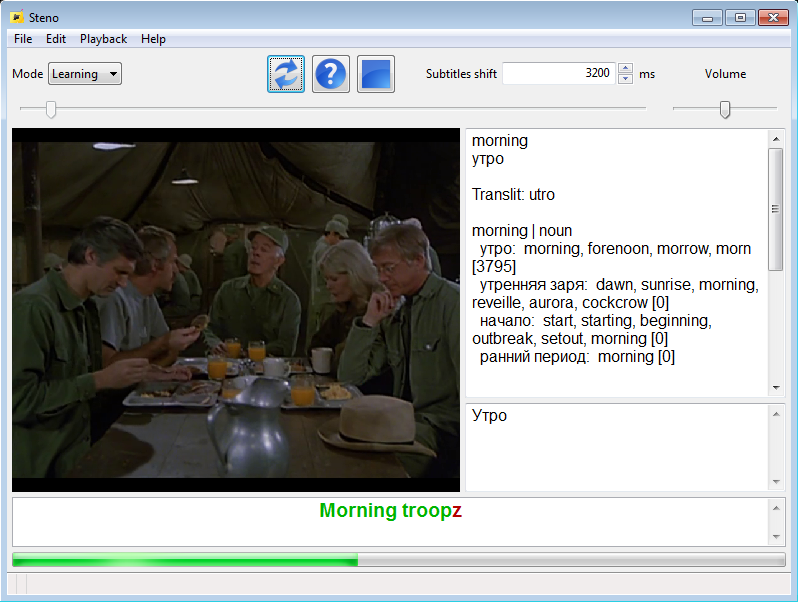
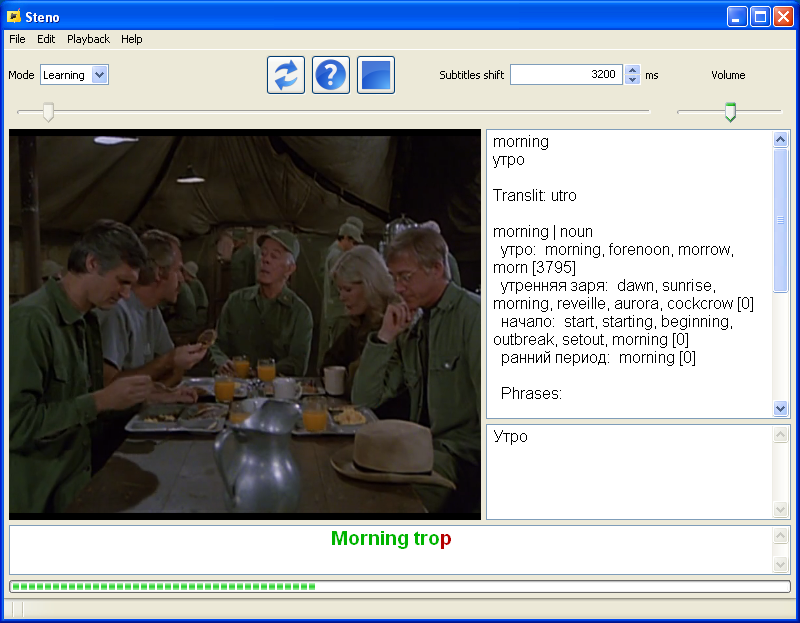
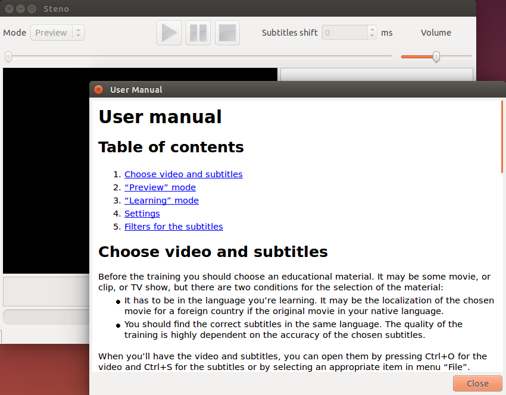
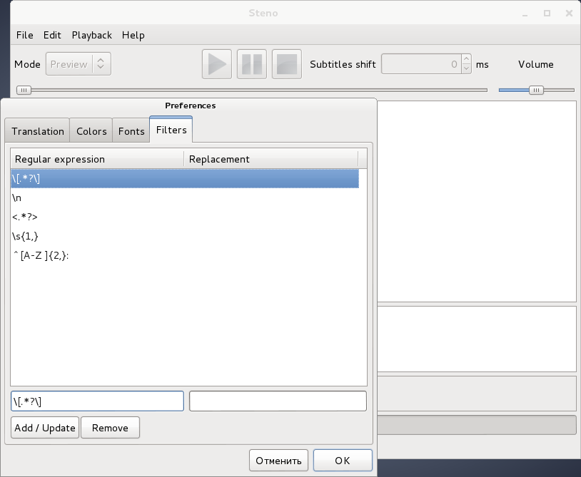
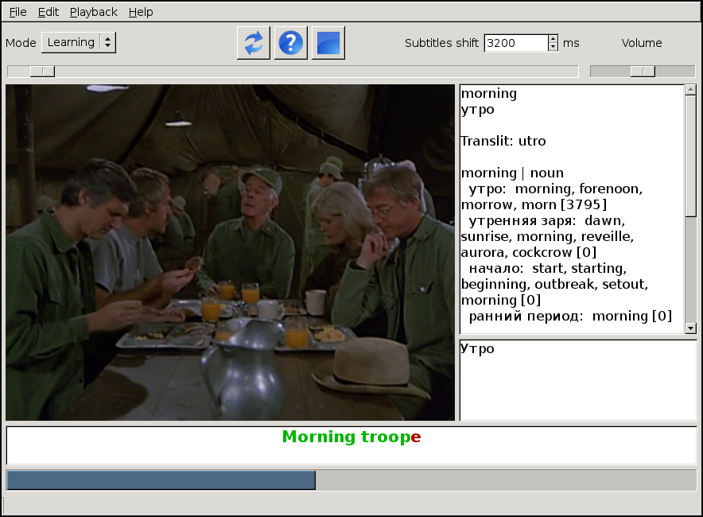

Project description
*******************

What is Steno
=============

Steno is an application that helps people learning a foreign language to train
listening skills.

What is the listening comprehension
===================================

The listening comprehension is an essential part of the language learning and
an important skill for every person who learn a foreign language. It's the
ability to perceive the speech in the studied language aurally.

How to get this skill and how Steno may help
============================================

Like most other skills, this can be got only by exercising regularly. We should 
listen to pronunciation of different people in order to gain experience,
which we'll use subsequently.

The learning will be more effectively, especially at the beginning, if we'll
listen to the legible pronunciation. Also, I think many will agree with me,
the training will be regularly and effective if it'll be enjoyable and
interesting. Therefore one of the possible ways to arrange the learning
process may be the watching of your favorite movies, clips, TV programs in
the foreign language.

But the usual viewing of movies isn't helpful enough, because you often
encounter with unfamiliar words, expressions, slang, and similar difficulties.
Of course, you'll quickly get tired of stopping playback after each missed word
in order to find it in a dictionary. Besides, we quickly cease to be attentive
to the particular details of the pronunciation, when we're intereseted, because
the context allows us to understand the meaning of words spoken, despite
the fact that we've missed any nuances. Thus, the learning will rapidly turn
into a waste of time which will not be useful enough for the skill enhancement.

Steno can make this process more resultative. To start the learning you'll need
to choose a movie in the language that you're learning and subtitles in
the same language. Then you should to watch the movie and type everything
characters say into an appropriate field of the application window. This
creates the necessary motivation for you in order to try to hear
the pronunciation in all details. This is what allows to enhance your skill
faster than if you had just watched the same movie.

The application pauses the playback after each sentence and continues to play,
when you typed the last word of this sentence. Steno provides the ability to
repeat the last sentence as many times as you wish. You can use hints if
necessary. Besides, a translation of a word and sentence appears on the screen
after the typing in order to help you find out the meaning of unfamiliar words
immediately, not being distracted by a dictionary.

Of course, interruptions of the playback and the attentive listening of the
pronunciation might reduce a pleasure from watching a movie, but this minor
inconvenience helps you to benefit from the time spent on an entertainment.
Probably, you won't watch a new movie in this rhythm, but it's a good reason
to re-watch your favorite movies. 

Screenshots
===========

Windows
-------

Windows 7
^^^^^^^^^

Windows XP
^^^^^^^^^^

Linux
-----

Ubuntu
^^^^^^

GTK decorated by Unity.

    
Debian
^^^^^^

GTK decorated by Gnome.

Gentoo
^^^^^^

GTK without decorations.
    
